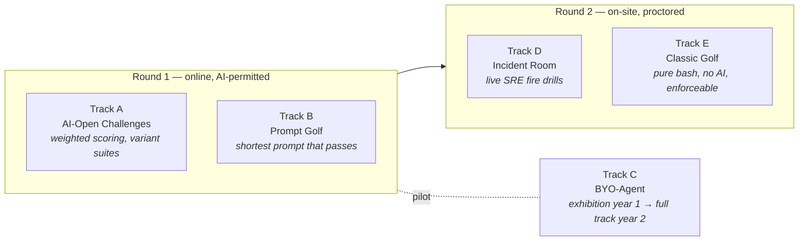

# Bashaway Evolution — AI-Era Competition Redesign

This documentation set proposes and specifies the evolution of Bashaway from a
pure bash-scripting competition into an AI-native scripting *and automation*
competition. It was produced from a full analysis of the six platform
repositories:

| Repository | Role today |
|---|---|
| [`bashaway-backend`](https://github.com/sliit-foss/bashaway-backend) | REST API: auth, questions, submissions, leaderboard, settings |
| [`scorekeeper`](https://github.com/sliit-foss/scorekeeper) | GitHub-Actions grading pipeline (jest-based, binary pass/fail) |
| [`bashaway-event-portal`](https://github.com/sliit-foss/bashaway-event-portal) | Competitor registration + submissions UI |
| [`bashaway-admin-portal`](https://github.com/sliit-foss/bashaway-admin-portal) | Event management, manual grading |
| [`bashaway-challenges`](https://github.com/sliit-foss/bashaway-challenges) | Public archive of challenges + team solutions (2022–2024) |
| [`bashaway-official`](https://github.com/sliit-foss/bashaway-official) | Annual landing sites (rules, timeline) |

## Why evolve

The competition's core loop — *write a small bash script that passes a hidden
jest suite, fastest team wins* — measures a skill (recall of shell idioms
under time pressure) that large language models have commoditized. Round 1 is
online and therefore unproctorable; binary all-or-nothing scoring plus a
speed tiebreak means an AI-assisted team's leaderboard position is decided by
prompting latency. The full problem statement and the response strategy are
captured in [ADR-0001](adr/0001-ai-native-format.md).

## How to read this set

Start with the ADRs in order — they record the *decisions* and their
trade-offs. Then read the architecture docs — they specify *how* the decided
system works, with diagrams.

### Architecture Decision Records

| ADR | Title | Status |
|---|---|---|
| [0001](adr/0001-ai-native-format.md) | Adopt an AI-native competition format | Proposed |
| [0002](adr/0002-weighted-partial-scoring.md) | Replace binary pass/fail with weighted partial scoring | Proposed |
| [0003](adr/0003-metered-model-proxy.md) | Provide sponsored LLM access through an organizer-run metering proxy | Proposed |
| [0004](adr/0004-prompt-golf-track.md) | Introduce the Prompt Golf track | Proposed |
| [0005](adr/0005-byo-agent-track.md) | Introduce the Bring-Your-Own-Agent track | Proposed |
| [0006](adr/0006-resubmission-penalty-and-variant-suites.md) | Resubmission penalties and hidden variant test suites | Proposed |
| [0007](adr/0007-onsite-incident-room-and-classic-golf.md) | On-site round: Incident Room + protected Classic Golf | Proposed |
| [0008](adr/0008-similarity-detection.md) | Cross-team similarity detection | Proposed |
| [0009](adr/0009-multi-track-leaderboard.md) | Multi-track leaderboard and data-model changes | Proposed |

### Architecture documents

| Doc | Contents |
|---|---|
| [01 — Current state](architecture/01-current-state.md) | Complete as-built architecture: context, containers, data model, grading sequence, anti-cheat inventory |
| [02 — Target state](architecture/02-target-state.md) | Future architecture: new components, per-track flows, revised data model |
| [03 — Scoring specification](architecture/03-scoring-spec.md) | Exact scoring formulas per track, with worked examples |
| [04 — LLM proxy design](architecture/04-llm-proxy.md) | The metering proxy: API surface, budget accounting, security |
| [05 — Agent sandbox design](architecture/05-agent-sandbox.md) | BYO-Agent runner: isolation model, limits, scoring hooks |
| [06 — Migration plan](architecture/06-migration-plan.md) | Repo-by-repo change list, DB migrations, phased rollout timeline |
| [07 — Security deep-dive](architecture/07-security-deepdive.md) | Threat model of the current runner with seven verified findings, attack chain, STRIDE table, ordered fixes |
| [08 — Archive analysis](architecture/08-archive-analysis.md) | Quantitative AI-vulnerability assessment of all 82 challenges and 638 archived solutions |
| [09 — Challenge design guide](architecture/09-challenge-design-guide.md) | Authoring principles, patterns, manifest schema, five worked example challenges |
| [10 — API contracts](architecture/10-api-contracts.md) | Route/payload deltas, workflow YAML diffs, reference `compute-score` and leaderboard pipeline code |
| [11 — Cost & capacity model](architecture/11-cost-capacity-model.md) | Parametric Actions-minutes, token-spend, storage and people model with committee dials |

### Rules

| Doc | Contents |
|---|---|
| [Draft rules](rules-draft.md) | Contestant-facing rules text for the AI-native edition, per track and round |

## Diagram conventions

All diagrams are [Mermaid](https://mermaid.js.org/) and render natively on
GitHub. Component diagrams follow a loose C4 style (context → container →
sequence). Existing components are drawn plain; **new components are marked
with `*`** in target-state diagrams.

## Read this first if you only read one thing

Doc 07's findings F1–F3 describe a verified path from a single submission
to full platform compromise on the **current** pipeline. Its §5 fix list
is small, independent of the redesign, and should land before the next
event of any format.

## Summary of the proposal

Five tracks across the existing two-round structure:

The unifying principle: **never rely on banning AI where you cannot see the
contestant; level the playing field and score judgment instead.**
