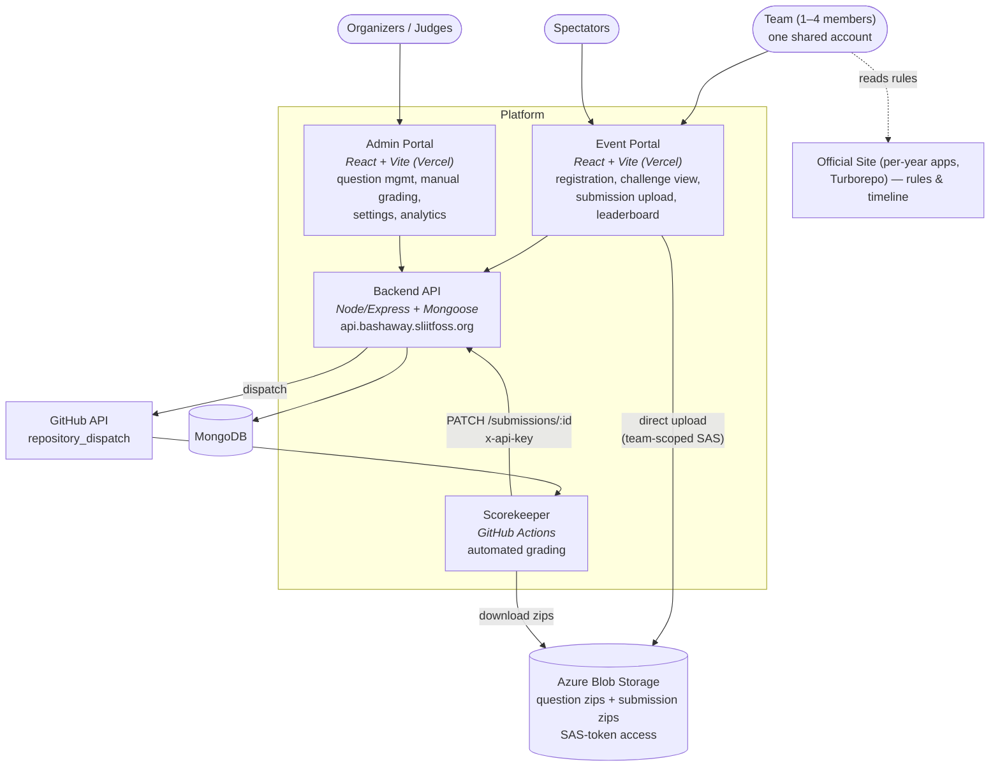
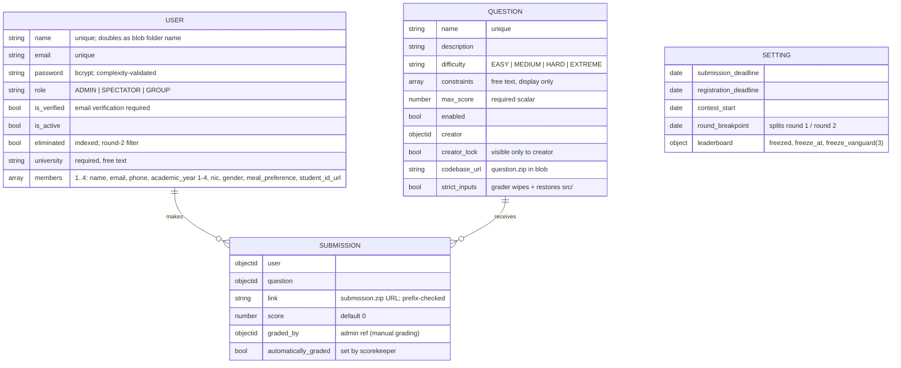
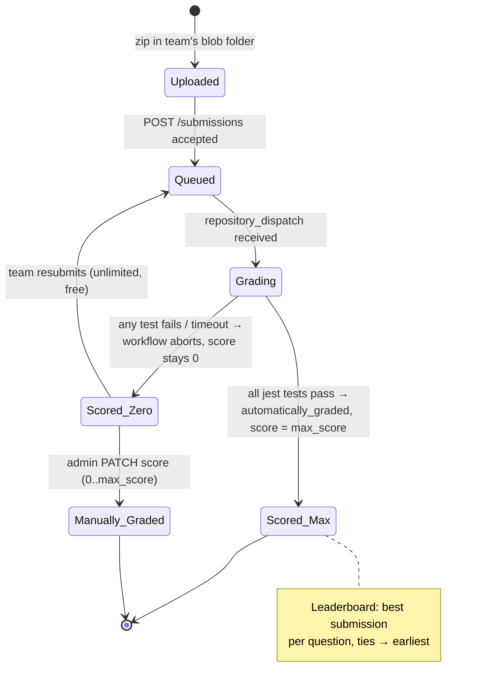
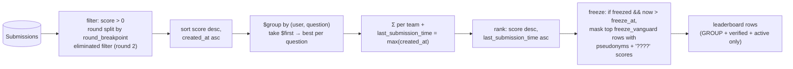

# Architecture 01 — Current State (as built, 2023–2025 platform)

This document records the platform as it exists across the six repositories,
as the baseline every ADR modifies. File references point at real paths in
`bashaway-backend` and `scorekeeper`.

## 1. System context



**Trust boundaries.** Teams authenticate with JWT; the scorekeeper→backend
channel uses a shared `x-api-key` (`middleware/auth.js`); blob access uses
container-level SAS tokens; the grading runner is a disposable
`ubuntu-22.04` GitHub-hosted VM.

## 2. Data model



Key invariants:

- **There is no Team model** — a User with `role: GROUP` *is* the team; all
  members share credentials (stated in the public rules).
- **Score is never stored on the user.** Migration
  `20230802065917-remove_score_from_user_model` removed it; totals are
  always aggregated from submissions at query time.
- A submission is "graded" iff `graded_by != null OR automatically_graded`.

## 3. Submission → grading sequence

```mermaid
sequenceDiagram
    autonumber
    participant T as Team (portal)
    participant B as Backend API
    participant G as GitHub API
    participant W as Scorekeeper workflow<br/>(ubuntu-22.04, 5-min cap)
    participant AZ as Azure Blob

    T->>AZ: upload submission.zip (team's own folder)
    T->>B: POST /api/submissions {question, link}
    B->>B: deadline check (now < submission_deadline)
    B->>B: question exists && enabled
    B->>B: link prefix must equal team's blob folder
    B->>B: insert Submission (score 0)
    B->>G: repository_dispatch run-{env}-tests<br/>{name,email,submission_id,submission_url,question_url,question_name,strict_inputs}
    G->>W: trigger test-prod.yml / test-staging.yml → test.yml
    W->>AZ: curl submission.zip (SAS) + question.zip (SAS)
    W->>W: clean (strip __MACOSX, lockfiles, .git, out, dist, dotfiles)
    W->>W: restore — DELETE submission/test, copy question/test + jest.config.js
    alt strict_inputs
        W->>W: rm -rf submission/src; copy question/src
    end
    W->>W: pnpm install --ignore-scripts --fix-lockfile
    W->>W: dos2unix execute.sh; bash execute.sh
    W->>W: clean again (preserve out/dist); re-download question.zip;<br/>restore tests a SECOND time (anti-mutation)
    W->>W: pnpm dlx jest@29.6.2
    alt all tests pass
        W->>B: PATCH /api/submissions/{id} {automatically_graded:true} (x-api-key)
        B->>B: gradeSubmission → score ??= question.max_score
    else any test fails
        W--xW: workflow aborts — score stays 0
    end
```

The binary outcome (step 15–18) is the single most consequential property
of the current design: **full `max_score` or nothing**. The scorekeeper
cannot transmit a number; the README states "All tests must pass for a
submission to be scored."

## 4. Submission lifecycle



## 5. Challenge anatomy (2023–2024 format)

```
challenge/
├── QUESTION.md          scenario + Constraints + Evaluation Criteria
├── question.zip         exact bundle handed to teams (stub execute.sh)
├── code/
│   ├── execute.sh       ← the ONLY file teams write (pure bash)
│   ├── package.json     pinned devDeps: jest 29.6.2, @faker-js/faker 8.0.2,
│   │                    @sliit-foss/actions-exec-wrapper, @sliit-foss/bashaway
│   ├── src/             optional input fixtures (regenerated by tests)
│   └── test/index.test.js   the grader
└── solutions/           published team zips (post-event)
```

A typical grader:

1. `beforeAll`: wipe `./src`, regenerate randomized fixtures with faker
   (random file counts/sizes/words/branches) — answers cannot be hardcoded.
2. `exec('bash execute.sh')` via `@sliit-foss/actions-exec-wrapper`,
   capture stdout; or assert side effects (`docker ps`, `kubectl get`,
   HTTP probes via axios).
3. Correctness assertions against a JS-computed oracle
   (`compactString`-normalized), or artifact reads (`out/merged.json`).
4. **Constraint block** (near-universal): `shellFiles().length === 1` and
   `=== scan('**', ['src/**']).length` (exactly one file, and it's shell);
   `dependencyCount()` equals the question's own devDep count (no extra
   packages); `restrictJavascript` / `restrictPython`; a
   `prohibitedCommands` regex; bans on invoking the grader helpers
   (`@sliit-foss`, `bashaway`); and for golf questions
   `expect(script.length).toBeLessThan(N)` over raw bytes.

## 6. Leaderboard pipeline



## 7. Anti-cheat inventory (all preserved by the evolution)

| Layer | Mechanism | Where |
|---|---|---|
| Submission origin | blob URL must start with team's own folder | backend `createSubmission` |
| Test integrity | team's `test/` deleted, question's copied — **twice** (post-execution re-restore) | scorekeeper `restore` action |
| Input integrity | `strict_inputs` wipes and restores `src/` | scorekeeper `test.yml` |
| Lifecycle-hook abuse | `pnpm install --ignore-scripts` | scorekeeper |
| Runner integrity | pinned `jest@29.6.2` via `pnpm dlx`; runner `src` restored via `git checkout` | scorekeeper |
| Artifact hygiene | clean action strips `.git`, lockfiles, `out`, dotfiles | scorekeeper |
| Resource abuse | 5-minute job timeout | scorekeeper |
| Language/dep escape | `shellFiles`, `dependencyCount`, `restrictJavascript/Python`, `prohibitedCommands` | per-question jest |
| Grading channel | `x-api-key` shared secret; the scorekeeper sends only `automatically_graded: true`, but the route accepts a numeric `score` too, and the key bypasses **all** auth and role checks platform-wide — see doc 07 F3 | backend |
| Information hiding | non-admins can only read their own submissions; leaderboard freeze | backend |

## 8. Security posture

The anti-cheat inventory above defends the *grading logic*; it does not
isolate the *runner*. Team-authored code runs as the same user, on the
same filesystem, with the same network as the scorekeeper's own
credentialed steps. Doc 07 records seven verified findings (background
processes surviving between steps, writable runner dependencies, the
global-bypass API key, browser-bundled SAS tokens, unrestricted egress,
dispatch-driven DoS, and public run titles) with an ordered fix list that
is independent of, and prerequisite to, the evolution work.

## 9. Known weaknesses this evolution addresses

1. Binary scoring + speed tiebreak + free resubmission — see ADR-0002/0006.
2. Unenforceable AI prohibition online — ADR-0001/0003.
3. Char-golf automatable — ADR-0004.
4. No cross-team similarity tooling despite published archives — ADR-0008.
5. Track-less data model blocks rubric/sub-task scoring the public rules
   already promise — ADR-0009.
6. (Hygiene, observed in the archive) several 2024 `QUESTION.md` files
   contradict their own graders (e.g. *Harsh Conditions*, *Centurion*) and
   two `package.json` name collisions — a challenge-CI lint (doc 06 §4)
   should gate future archive commits.
