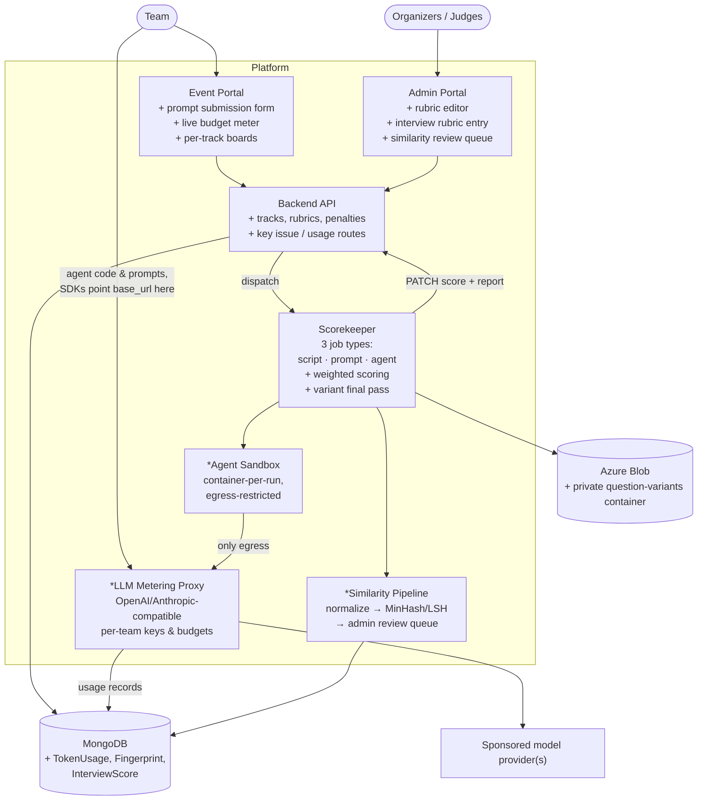
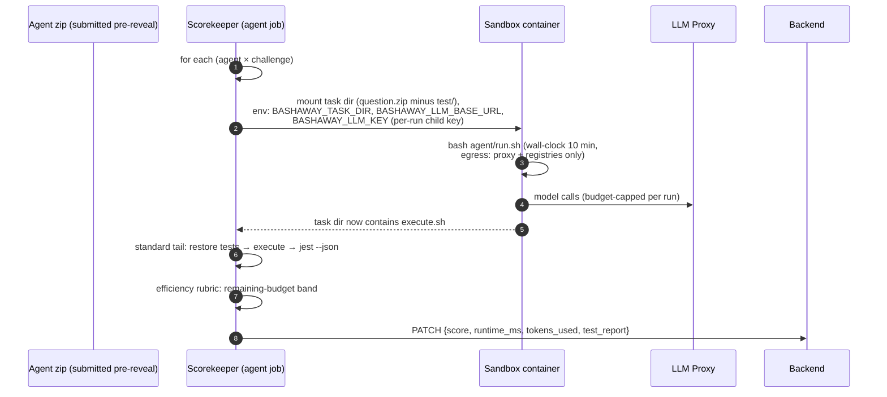
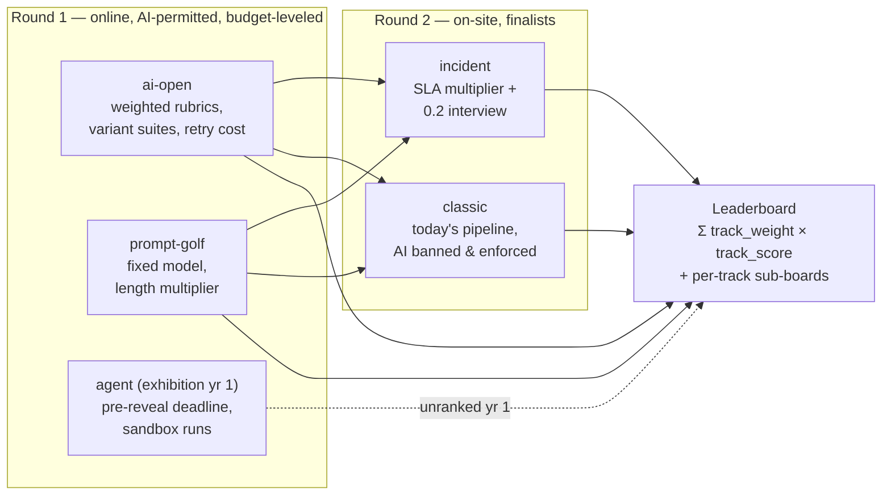
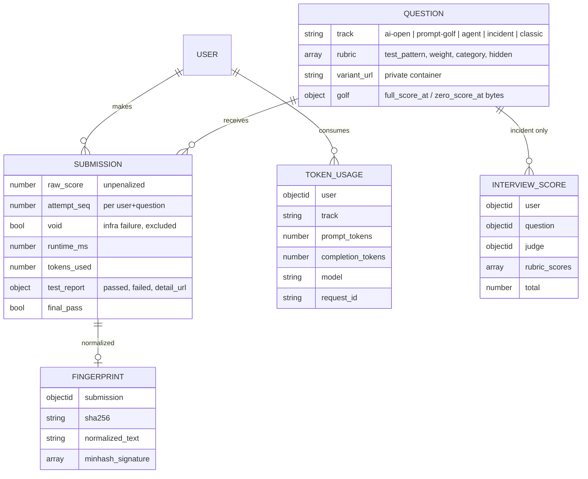

# Architecture 02 — Target State

The target architecture is the current platform (doc 01) **plus three new
components** and **extended contracts** — no existing component is replaced.
New components are marked `*`.

## 1. Target system context



## 2. The three grading job types

The scorekeeper keeps its dispatch-driven shape and gains two event types
beside the existing one:

| Dispatch event | Track(s) | What runs |
|---|---|---|
| `run-{env}-tests` | AI-Open, Incident, Classic | today's pipeline + jest `--json` weighted scoring (ADR-0002) |
| `run-{env}-prompt-tests` | Prompt Golf | prompt → pinned model via proxy → extract script → today's pipeline (ADR-0004) |
| `run-{env}-agent-tests` | BYO-Agent | agent in sandbox writes `execute.sh` → today's pipeline (ADR-0005) |

All three converge on the same tail: **restore tests → jest → weighted
score → authenticated PATCH**. The anti-cheat inventory (doc 01 §7)
applies unchanged to all three.

### 2.1 Prompt Golf sequence

```mermaid
sequenceDiagram
    autonumber
    participant T as Team
    participant B as Backend
    participant W as Scorekeeper (prompt job)
    participant P as LLM Proxy
    participant M as Pinned model

    T->>B: POST /submissions {question, link→zip with prompt.txt}
    B->>W: dispatch run-{env}-prompt-tests
    W->>W: download + clean submission; assert ONLY prompt.txt present
    W->>P: POST /v1/messages (system-fixed, temp 0, team's key)
    P->>M: forward (organizer upstream key)
    M-->>P: response + usage
    P->>P: record TokenUsage
    P-->>W: response
    W->>W: extract first fenced code block → execute.sh<br/>(none → score 0)
    W->>W: standard tail: restore tests → bash execute.sh → jest --json
    W->>W: score = rubric_score × length_multiplier(bytes of prompt.txt)
    W->>B: PATCH {score, automatically_graded, test_report, tokens_used}
```

### 2.2 BYO-Agent sequence



### 2.3 Variant final pass (ADR-0006)

```mermaid
sequenceDiagram
    autonumber
    participant C as Round close (cron / admin action)
    participant B as Backend
    participant W as Scorekeeper
    participant V as Private variants container

    C->>B: trigger final pass
    B->>B: select best submission per (team, question)
    loop each selected submission
        B->>W: dispatch with variant_url included
        W->>V: download variant suite (separate SAS)
        W->>W: run visible + variant suites, weighted score
        W->>B: PATCH {score, final_pass: true}
    end
    B->>B: leaderboard now prefers final_pass scores;<br/>apply resubmission multiplier; unfreeze
```

## 3. Track-to-round mapping



## 4. Target data model (delta)



All changes are additive (ADR-0009); the doc-01 invariants — no Team model,
score derived not stored, graded-iff rule — are preserved.

## 5. Failure modes and mitigations

| Failure | Blast radius | Mitigation |
|---|---|---|
| LLM proxy down during round | prompt-golf & agent grading stall; ai-open unaffected | stateless proxy behind LB; scorekeeper retries with backoff; submissions stay Queued, not lost (dispatch is re-fireable from the backend) |
| Model snapshot behavior drifts mid-contest | golf scores shift | pin dated snapshot; hourly canary prompt with known-good output; freeze window covers late anomalies |
| Agent hangs / forks bombs | one run's runner | container PID & memory limits, 10-min wall clock, run marked `void`, one free re-run on infra failure |
| Budget exhaustion mid-run | that team's run | proxy returns 429; agent's handling of exhaustion is itself part of the skill (documented in rules) |
| Variant pass reveals grading bug | final scores disputed | journal every run (Actions URLs in `test_report.detail_url`); admin manual grade path remains the override of record |
| Actions minute exhaustion | all automated grading | resubmission penalty reduces volume; self-hosted runner fallback for the final pass (on-site hardware already exists for round 2) |
