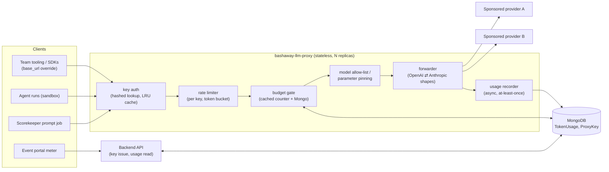
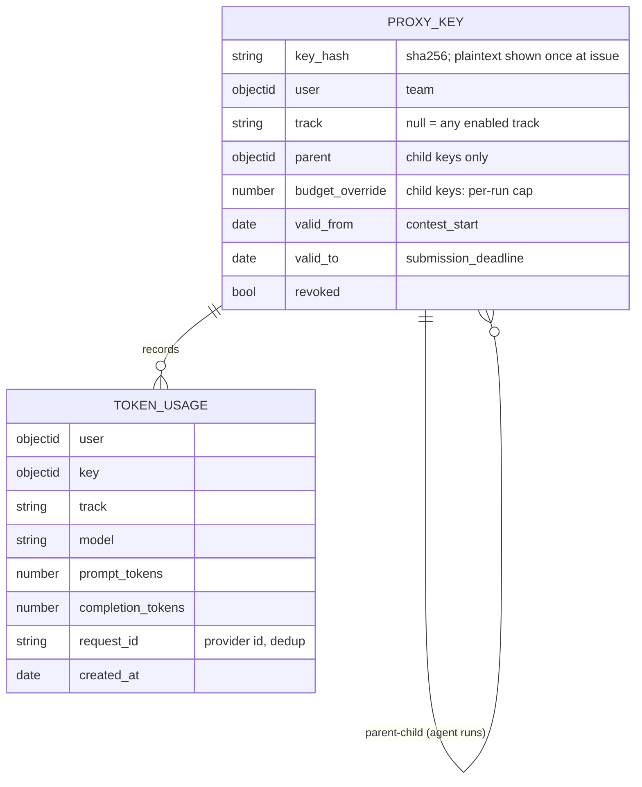

# Architecture 04 — LLM Metering Proxy (`bashaway-llm-proxy`)

Design for the new service decided in ADR-0003. New repository, same
conventions as the rest of the platform (Node, conventional commits,
lefthook).

## 1. Responsibilities

1. Terminate all sanctioned model traffic during online events.
2. Enforce identical per-team, per-track token budgets.
3. Record every request's usage for scoring, live meters, and post-event
   publication.
4. Pin model + parameters for Prompt Golf grading.
5. Hold the only copies of upstream provider keys.

Non-goals: prompt storage beyond golf grading (privacy — request/response
*bodies* are not persisted except for golf grading runs, which are
published anyway), content moderation beyond provider defaults, streaming
aggregation gymnastics (streaming is supported; usage is taken from the
terminal event).

## 2. Component view

## 3. API surface

### Model endpoints (team-key auth: `Authorization: Bearer bw-<key>`)

| Endpoint | Notes |
|---|---|
| `POST /v1/chat/completions` | OpenAI-compatible; `model` must be allow-listed |
| `POST /v1/messages` | Anthropic-compatible |
| `GET /v1/models` | the allow-list, with per-track availability |

Behavioral contract:

- Unknown/disallowed `model` → `404 model_not_found` (mirrors provider
  shape so SDK error handling works).
- Budget exhausted → `429 { "error": { "type": "budget_exhausted",
  "remaining": 0, "resets": null } }`. **Never** silently truncate.
- Parameter pinning (golf mode keys): client-supplied `temperature`,
  `top_p`, `system` are **rejected** (`400 pinned_parameter`) rather than
  overridden, so behavior is never silently different from what the client
  believes it requested.
- Streaming supported; usage recorded from the final chunk; connection
  drop after partial stream still records upstream-billed usage.

### Control endpoints (backend only, `x-api-key` — same pattern as the scorekeeper channel)

| Endpoint | Purpose |
|---|---|
| `POST /admin/keys/batch` | issue keys for all verified GROUP teams at contest start |
| `POST /admin/keys/:team/child` | mint a per-run child key (agent runs) with a sub-budget |
| `DELETE /admin/keys/:id` | revoke |
| `GET /admin/usage?group_by=team,track` | aggregates for scoring & publication |

The backend re-exposes team-facing reads: `GET /api/llm/usage/self`
(remaining budget per track — powers the portal meter).

## 4. Data model

Budget check: `Σ TokenUsage(user, track) < Setting.llm_budgets[track]`,
served from an in-memory counter per (user, track) refreshed from Mongo on
a short interval; the counter admits bounded overshoot (one in-flight
request per replica) which is accepted and stated in the rules ("budgets
are enforced within a small tolerance").

## 5. Security model

| Threat | Control |
|---|---|
| Team key leaks publicly | contest-window validity; per-key rate limit; revoke + reissue via admin route; keys hashed at rest |
| Upstream key exfiltration | upstream keys exist only in proxy env; `Authorization` stripped and replaced at forward; sandbox egress cannot reach providers directly |
| Budget bypass via header games | budget applies to the authenticated key, whatever the payload claims; child keys capped by `budget_override` AND parent budget |
| Sponsored-credit abuse for non-contest work | window scoping + rate limits + published acceptable-use rule + post-event per-team usage publication (social enforcement) |
| Proxy as DDoS amplifier | global concurrency cap; per-key token bucket; only registered verified teams hold keys |
| Replay of usage writes | `request_id` unique index (at-least-once recorder dedupes) |

## 6. Operational notes

- **Stateless replicas** behind the same host pattern as the backend
  (`llm.bashaway.sliitfoss.org`); scale-out is horizontal; Mongo is the
  only shared state.
- **Contest-start spike**: load test at (teams × 5 rps) burst; the token
  bucket flattens the rest.
- **Canary**: an hourly synthetic golf prompt with a known-good expected
  script; drift alerts the committee before it corrupts scores (doc 02 §5).
- **Grace mode**: if Mongo usage writes degrade, the proxy queues records
  in memory and keeps serving (bounded queue, alert on depth) — grading
  fairness beats perfect accounting mid-round.
- **Logging**: request metadata only (key id, model, token counts,
  latency, status). Bodies logged **only** for scorekeeper-key golf runs.
  This aligns with the backend README's observability warning — the proxy
  is a public-facing service and must launch with full request-metadata
  logging from day one.
