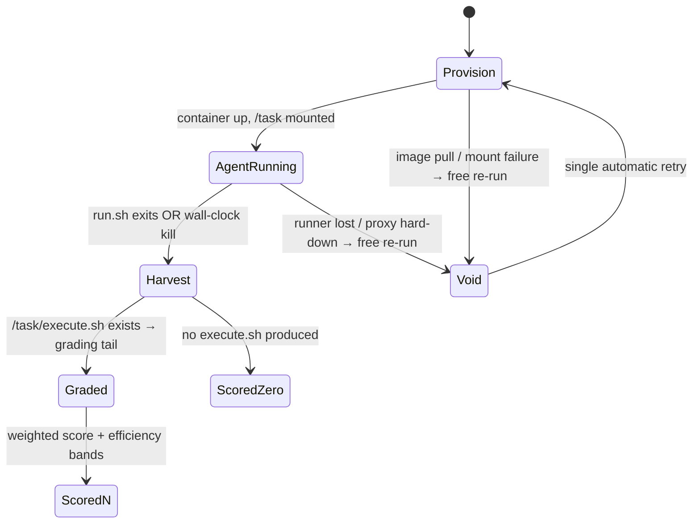

# Architecture 05 — Agent Sandbox (BYO-Agent runner)

Design for the execution environment decided in ADR-0005. This is the
largest new engineering effort in the proposal; it is also a strict
generalization of what the scorekeeper already does (run untrusted zips in
a disposable VM under a timeout), tightened because agents run *longer*,
*spend money*, and *must not see the grader*.

## 1. Requirements

| # | Requirement | Source |
|---|---|---|
| R1 | Agent must never read the test suite or variant suite | grading integrity |
| R2 | Agent's only model access is the team's proxy budget | ADR-0003 fairness |
| R3 | Egress limited to LLM proxy + package registries | prevent phone-home to humans (no human in the loop) |
| R4 | Hard resource caps: wall-clock, CPU, memory, disk, PIDs | runner survival |
| R5 | Identical environment for every team | fairness |
| R6 | Full run journal for dispute resolution | ADR-0005 consequences |
| R7 | Infra failure distinguishable from agent failure | `void` semantics, free re-run |

## 2. Execution topology

One GitHub Actions job per (agent × challenge); inside the job, the agent
runs in a **container with no default network**, attached to an internal
network whose only other member is a local egress gateway.

```mermaid
flowchart TB
    subgraph Job["Actions job (per agent × challenge, timeout 15 min)"]
        subgraph NET["internal docker network (no internet)"]
            subgraph C["agent container (ubuntu-22.04 image, pinned digest)"]
                RUN["bash agent/run.sh<br/>uid 1000, no docker socket<br/>cpu 2, mem 4G, pids 512,<br/>disk quota 2G, wall 10 min"]
                TD["/task (rw) — question minus test/"]
                AD["/agent (ro) — team's zip"]
            end
            GW["egress gateway (tinyproxy)<br/>allow-list:<br/>· LLM proxy host<br/>· registry.npmjs.org / pypi.org<br/>· distro mirrors<br/>everything else → 403"]
        end
        TAIL["grading tail (outside container):<br/>restore tests → execute → jest --json<br/>→ weighted score → PATCH"]
    end
    C -->|HTTP(S)_PROXY| GW
    GW --> PROXY["LLM proxy"]
    GW --> REG["package registries"]
    C -->|"/task after run"| TAIL
```

Key placements:

- **The grader never enters the container.** `/task` is `question.zip`
  *minus* `test/` and minus `variant` anything (R1). The grading tail runs
  on the host job after the container exits, using the existing
  restore-tests-twice machinery.
- **Model access** is injected as env (`BASHAWAY_LLM_BASE_URL`,
  `BASHAWAY_LLM_KEY`) where the key is a **per-run child key** minted via
  the proxy's `POST /admin/keys/:team/child` with `budget_override` = the
  per-run budget, and revoked at job end (R2). Even if the agent leaks its
  key, it dies with the run.
- **Egress** goes through a proxy allow-list (R3); DNS resolves only inside
  the gateway. Registries are included because `agent/run.sh` may
  legitimately install its own runtime deps; a pre-baked cache image cuts
  this in practice.

## 3. Run contract (published to teams)

```
Input : /task            — the challenge project, exactly as a human gets it
        /agent           — your zip, read-only
        $BASHAWAY_TASK_DIR, $BASHAWAY_LLM_BASE_URL, $BASHAWAY_LLM_KEY
        $BASHAWAY_TRACK, $BASHAWAY_TIME_BUDGET_S, $BASHAWAY_TOKEN_BUDGET

Entry : bash /agent/run.sh          (any stack inside; bring your runtime)

Output: /task/execute.sh            — your answer; must satisfy the same
                                      constraints as a human submission
                                      (single shell file, no extra deps…)

Limits: 10 min wall, 2 vCPU, 4 GB RAM, 512 pids, 2 GB disk,
        per-run token budget; 429 budget_exhausted is YOUR problem to handle
Exit  : run.sh exit code is informational; scoring reads /task only
```

The constraint tests (single shell file, dependency count, language
restrictions) apply to `/task` exactly as for human submissions — so an
agent that scatters helper files loses to `scan('**')`, the same wall
humans face. This symmetry is deliberate: **the agent track changes who
writes `execute.sh`, not what a valid `execute.sh` is.**

## 4. Scheduling and cost

For `A` agents × `C` challenges: runs are independent → a matrix
workflow with `max-parallel` tuned to the Actions concurrency the org can
spend. Year-1 exhibition sizing keeps this trivial:

```
A ≤ 20 teams, C = 5 challenges → 100 jobs × ≤15 min ≤ 25 runner-hours
Token cost ≤ A × C × per-run budget (hard cap, known before the event)
```

Both caps are known *in advance* — this is the budget line item shown to
sponsors.

## 5. Failure classification (R7)



- **Void** (infrastructure fault): submission marked `void: true`, does not
  count as an attempt, one automatic re-run.
- **Agent fault** (hang until wall-clock, crash, no output, budget blown):
  scored as-is. The line between the two is mechanical: void requires a
  failure *before or outside* the agent's own execution.
- Every run journals: container logs, egress log (hosts only), proxy usage,
  and the Actions URL — stored in `test_report.detail_url` for disputes.

## 6. Threats specific to this track

| Threat | Control |
|---|---|
| Agent reads grader | `test/` never mounted; tests restored on host after container exit (existing double-restore step) |
| Agent phones a human ("mechanical turk") | egress allow-list; runs happen inside a single contest window, journaled |
| Agent attacks the proxy (key brute force) | per-key rate limit; child key scoped to one run's budget |
| Agent escapes container | no privileged mode, no docker socket, non-root uid, pinned base image, seccomp default; runner VM is disposable anyway (defense in depth, not a research-grade boundary — stated honestly in the rules) |
| Team hardcodes challenge guesses | agents submitted before challenge reveal (`agent_submission_deadline`); fixtures randomized per run by the existing faker `beforeAll` pattern |
| Nondeterminism disputes | journaled transcripts; exhibition year is explicitly non-ranked while variance is measured |
