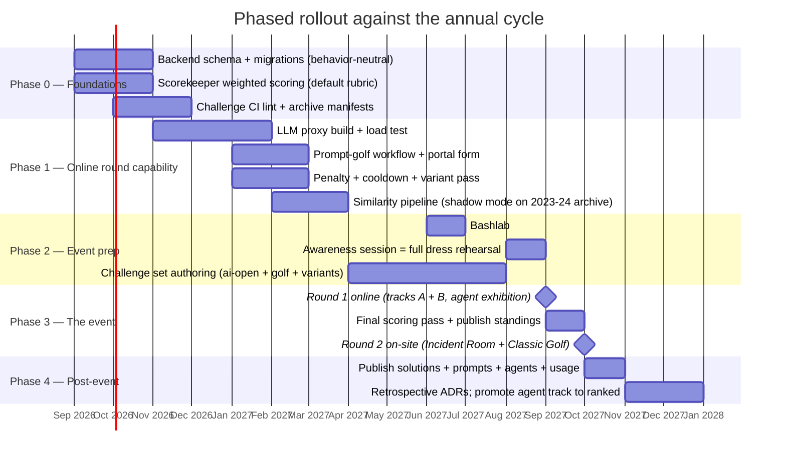

# Architecture 06 — Migration Plan

Repo-by-repo change inventory, database migrations, and a phased rollout
mapped to the annual event cycle. Everything is sequenced so that **after
every phase the platform can still run a classic-format event** — the
migration never crosses a point of no return before the committee has seen
each piece work.

## 1. Change inventory by repository

### `bashaway-backend`

| Change | ADR | Notes |
|---|---|---|
| Question: `track`, `rubric[]`, `variant_url`, `golf{}` | 0002/0004/0009 | additive; pre-save hook keeps `max_score = Σ rubric.weight` |
| Submission: `raw_score`, `attempt_seq`, `void`, `runtime_ms`, `tokens_used`, `test_report`, `final_pass` | 0002/0006/0009 | additive; `attempt_seq` set in `createSubmission` (same place as the deadline & blob-prefix checks) |
| Setting: `tracks[]`, `agent_submission_deadline`, `resubmission_penalty`, `llm_budgets[]` | 0009 | singleton update |
| Grade route accepts numeric `score` + `test_report` from scorekeeper key | 0002 | keep the `0 ≤ score ≤ max_score` clamp already used for manual grading; keep `x-api-key` |
| Submission cooldown (10 min per question) in `createSubmission` | 0006 | one guard clause beside the deadline check |
| Leaderboard aggregation: penalty stage, track weights, per-track boards, interview join | 0006/0007/0009 | pure aggregation change; freeze/round/elimination stages untouched |
| New routes: `POST /api/llm/keys` (admin), `GET /api/llm/usage/self` | 0003 | thin passthrough to proxy control API |
| New collections: `TokenUsage`, `Fingerprint`, `InterviewScore` | 0003/0007/0008 | |
| Final-pass trigger (admin route + scheduled job at round close) | 0006 | re-dispatches best submissions with `variant_url` |

Migrations (migrate-mongo, following the existing pattern):

```
2026xxxx-add-track-and-rubric-to-questions.js
    // every existing question: track='classic',
    // rubric=[{test_pattern:'.*', weight:max_score, category:'correctness'},
    //         {test_pattern:'(dependencies|installed)', weight:0, category:'constraint'}]
    // → invariant 8.4 of the scoring spec: behavior identical to today
2026xxxx-add-scoring-fields-to-submissions.js
    // backfill: raw_score=score, attempt_seq per (user,question) by created_at,
    // void=false, final_pass=false
2026xxxx-extend-settings-singleton.js
2026xxxx-create-usage-fingerprint-interview-collections.js   // + indexes:
    // TokenUsage {user,track}, {request_id unique}
    // Submission {user,question,attempt_seq}, {question,user,score,created_at}
```

### `scorekeeper`

| Change | ADR | Notes |
|---|---|---|
| jest step: `--json --testLocationInResults`, `continue-on-error: true` | 0002 | |
| New step `compute-score`: rubric matching + gates + multipliers → numeric PATCH | 0002/0004 | extends `src/services/score.js`, which today only sends the boolean |
| New workflow `prompt-test.yml` (dispatch `run-{env}-prompt-tests`) | 0004 | proxy call + code-block extraction, then reuses `test.yml`'s tail via a composite action |
| New workflow `agent-test.yml` (dispatch `run-{env}-agent-tests`) | 0005 | sandbox per doc 05; matrix over challenges |
| Variant-pass input: optional `variant_url` + second SAS secret | 0006 | reuses restore machinery |
| Post-grade fingerprint step (normalize + minhash → backend) | 0008 | |
| `void` reporting on infra-stage failures | 0006 | distinguish steps before/after "agent/script ran" |

### `bashaway-llm-proxy` (new repo)

Built per doc 04. Milestones: (1) forwarder + key auth, (2) budgets +
usage, (3) parameter pinning + golf mode, (4) child keys, (5) canary +
grace mode.

### `bashaway-event-portal`

- Prompt Golf submission form (textarea → zips `prompt.txt` client-side,
  same blob upload path).
- Budget meter (polls `/api/llm/usage/self`).
- Per-question attempt count + current multiplier display.
- Track tabs on challenges and leaderboard.
- Agent-zip upload flow gated by `agent_submission_deadline`.

### `bashaway-admin-portal`

- Rubric editor on the question form (table of pattern/weight/category/
  hidden) with a "validate against uploaded test suite" dry-run.
- Interview rubric entry (writes `InterviewScore`) inside the existing
  manual-grading UI.
- Similarity review queue (pairs ranked by similarity × distinctiveness,
  side-by-side normalized diff, timestamps).
- Settings: track weights, budgets, penalty constants, final-pass trigger.

### `bashaway-challenges`

- Adopt per-challenge `manifest.json` (`track`, `rubric`, golf params) so
  the archive is the source of truth admins import from.
- **Challenge CI lint** (fixes the observed 2024 hygiene drift): every PR
  runs each challenge's suite against its reference solution (green) and
  against the stub (red), validates `QUESTION.md` mentions match test
  behavior via the manifest, and checks `package.json` name uniqueness.
- New top-level dirs per event: `prompts/` and `agents/` archives join
  `solutions/`.

### `bashaway-official`

- Rules content per track and per round (AI policy stated per event).
- Timeline gains `agent submission deadline` and `final scoring pass`
  entries.

## 2. Rollout phases



### Phase gates (go/no-go criteria)

| Gate | Criterion |
|---|---|
| P0 → P1 | invariant 8.4 holds: replaying a sample of 2024 submissions through the weighted pipeline with default rubrics reproduces their historical scores exactly |
| P1 → P2 | proxy survives load test at contest-spike volume; golf canary stable for 2 weeks; similarity shadow run reviewed by committee |
| P2 → P3 | dress rehearsal (awareness session, already traditionally "a simulated battle") completes all three job types end-to-end with real student traffic |
| exhibition → ranked agents | variance measured across repeated agent runs is within committee-accepted bounds; no unresolved disputes from exhibition |

## 3. Risk register (top items)

| Risk | L | I | Mitigation |
|---|---|---|---|
| Proxy outage mid-round | M | H | stateless replicas; ai-open track unaffected; dispatches re-fireable; announced pause protocol extends deadline via Setting |
| Sponsored budget overrun | M | M | hard budget caps make worst case = teams × budget, known pre-event |
| Rubric authoring errors mis-score a question | M | H | admin dry-run validator; challenge CI runs reference solution against rubric; manual-grade override is the standing correction path |
| Weighted scoring disputes | M | M | `test_report.detail_url` links the exact Actions run; scores recomputable from immutable raw data |
| Actions minutes exhausted | L | H | cooldown + penalty reduce volume; self-hosted runner fallback for final pass |
| Committee bandwidth (this is a lot) | H | H | phases are independently shippable; the minimum viable event is Phase 0+1 without agents (tracks A+B online, D+E on-site) |

## 4. What deliberately does not change

- Registration, team model (1–4 members, shared credentials), email
  verification, university free-text field.
- Blob layout and the team-folder submission-origin check.
- The clean/restore/strict-inputs anti-cheat machinery — reused by every
  new job type.
- Round structure, elimination, `round_breakpoint`, leaderboard freeze
  theatrics.
- The publication tradition — extended, not altered.
- The classic format itself — protected on-site, byte-for-byte the same
  pipeline.
