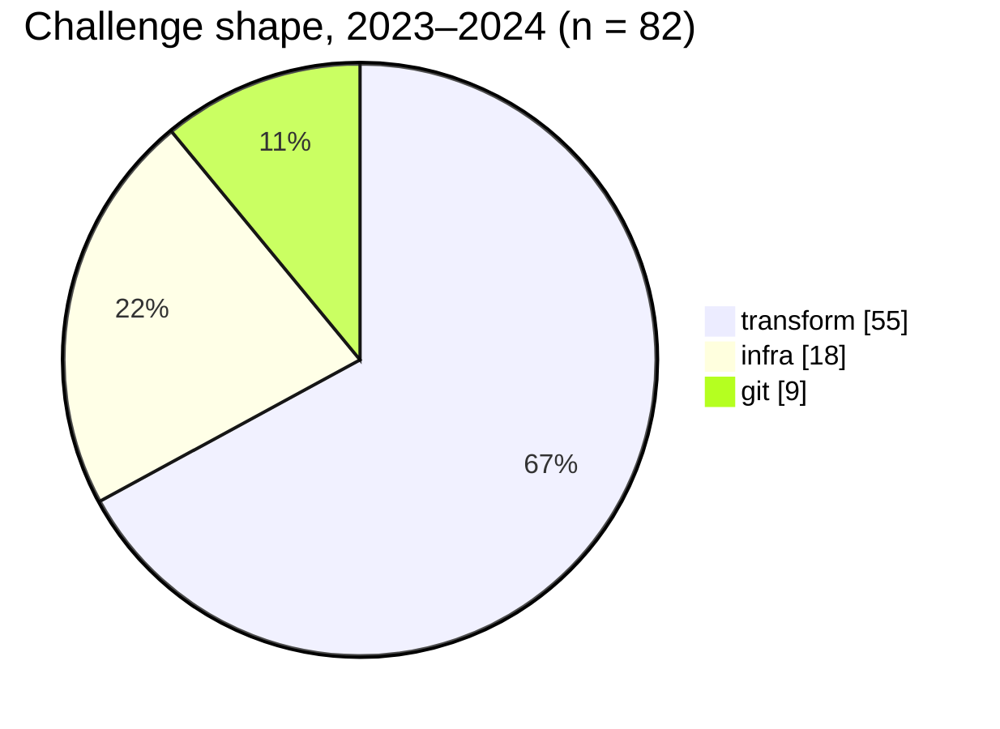

# Architecture 08 — Archive Analysis: AI Vulnerability of the 2023–2024 Challenge Set

A quantitative assessment of the 82 graded challenges and 638 archived team
solutions in `bashaway-challenges`, produced by scripted analysis of the
repository. This is the evidence base for ADR-0001's claim that the current
format is one-prompt-solvable, and the calibration data for the challenge
design guide (doc 09) and the cost model (doc 11).

## 1. Corpus

| | 2023 | 2024 | Total |
|---|---|---|---|
| Challenges (easy / medium / hard / extreme) | 42 (23/9/4/6) | 40 (22/11/4/3) | 82 |
| Archived successful team solutions (zips) | 278 | 360 | 638 (637 contain an `execute.sh`) |
| Mean successful solutions per challenge | 6.6 | 9.0 | |
| Median successful solutions per challenge | 3 | 8.5 | |
| Challenges with zero successful solutions | 1 (*devtopia*) | 1 (*Sealed Whispers*) | 2 |

Solutions per challenge by difficulty (mean):

```mermaid
xychart-beta
    title "Mean successful solutions per challenge"
    x-axis ["easy", "medium", "hard", "extreme"]
    y-axis "solutions" 0 --> 14
    bar [9.7, 4.0, 2.5, 1.7]
    bar [12.5, 6.4, 3.0, 1.0]
```

(first series 2023, second 2024.) Easy challenges are solved by roughly a
dozen teams; extreme ones by one. The difficulty gradient is steep and
real — for humans.

## 2. Challenge shape

Each challenge was classified by what its grader actually checks:

- **transform** — read input (files/stdout/args), emit output; verified by
  string/JSON/CSV comparison against a JS oracle.
- **git** — manipulate a repository's history, branches, hooks; verified by
  `git` queries.
- **infra** — stand up or repair services (docker, k8s, redis, mongo, nginx,
  CI under `act`, registries); verified by process/network/HTTP probes.

| Shape | 2023 | 2024 | Trend |
|---|---|---|---|
| transform | 30 (71%) | 25 (63%) | falling |
| git | 4 | 5 | flat |
| infra | 8 (19%) | 10 (25%) | rising |

Infra share rose by half between editions — the authors were already
drifting toward environment-bound problems, which is the right direction
for the AI era (§5).

Technology tags across all challenges (a challenge may carry several):

| Tag | Count | Tag | Count |
|---|---|---|---|
| http probes (axios/curl/localhost) | 30 | k8s | 7 |
| plain text I/O | 15 | mongo | 6 |
| git | 9 | redis | 4 |
| json / jq | 9 | gh-actions / `act` | 4 |
| docker | 5 | csv, pdf, media, cron, registry | 1–3 each |

## 3. Solution size

Byte and line counts of the 637 archived `execute.sh` files
(`scripts/archive-stats.py` in the challenges repo, §8):

| Percentile | Bytes | Lines |
|---|---|---|
| p10 | 32 | 1 |
| p25 | 100 | 3 |
| p50 | **297** | **13** |
| p75 | 640 | 25 |
| p90 | 1,107 | 42 |
| max | 3,609 | 180 |

Reference solutions committed by the organizers (56 non-empty of 82):
median ≈ 120 bytes; only 8 exceed 1 KB; one outlier (2023 extreme) at
≈19.7 KB.

**Reading:** half of all winning submissions fit in a tweet; nine in ten
fit on one screen. This is the size regime in which current models are
essentially error-free for well-specified tasks.

## 4. Grader mechanics

| Mechanism | Challenges using it | Share |
|---|---|---|
| faker-randomized fixtures (`beforeAll`) | 42 | 51% |
| `restrictJavascript` / `restrictPython` | 43 | 52% |
| `prohibitedCommands` regex | 47 | 57% |
| single-shell-file + `dependencyCount` block | 77 | 94% |
| character-golf byte limit | 14 | 17% |

Golf limits used: 10, 25, 30, 30, 40, 40, 45, 50, 75, 75, 100, 100, 150, 300
bytes. The 10-byte challenge (*Emblem of Singularity*) has a 7-byte
reference solution.

The grader helper library `@sliit-foss/bashaway` is pinned per challenge
across five versions (`1.3.0-blizzard.2` ×23, `1.6.0-blizzard.0` ×44, three
others); its source is not in any of the six repos — a maintenance risk
noted for the migration plan (doc 06 §1, challenges repo).

## 5. Prompt-solvability assessment

A challenge is *one-prompt-solvable* when its `QUESTION.md` plus visible
test file, pasted into a frontier model, yields a passing `execute.sh` on
the first or second try without the team understanding the solution. We
rate each shape on the properties that determine this:

| Property | transform | git | infra |
|---|---|---|---|
| Fully specified in text | yes — the test *is* the spec | yes | partially — depends on environment state |
| Verifiable by the model itself | yes (mental execution) | mostly | no — needs the live environment |
| Solution size (median) | ~150 B | ~300 B | ~600 B–2.7 KB |
| Environment-dependent steps | none | none | many (ports, images, network names, versions) |
| **Assessed solvability** | **very high** | **high** | **medium** (agent loop, not one prompt) |
| Share of corpus | 67% | 11% | 22% |

Consequently roughly **three quarters of the 2023–2024 corpus falls to a
single prompt**, and the remaining quarter falls to a short
generate-run-fix loop that any agentic coding tool automates. The golf
subset is *not* protected: models iterate against `script.length` limits
as readily as against correctness.

Two caveats that keep this honest:

- We did not run a model over the corpus in this analysis (no model access
  in the analysis environment). The rating is structural. It should be
  validated empirically as **Phase 0 work** in the migration plan — the
  archive is a ready-made benchmark and the result is itself publishable.
- "Solvable by AI" and "won by AI" differ: the speed tiebreak means the
  effect on rankings is that AI-assisted teams cluster at max score and
  are ordered by latency — which is the ADR-0001 argument, not a claim
  that every team used AI in 2024/2025.

## 6. What the archive says about durable challenge design

Properties that correlate with *low* solve counts in the data, and survive
AI, are exactly the infra/extreme properties:

1. **Environment-bound verification** — the grader probes live state
   (`docker ps`, `kubectl get`, HTTP health) rather than comparing strings.
2. **Multi-stage state** — success requires ordered side effects (build →
   network → run → expose), each with failure modes the model can't see
   from the prompt.
3. **Hidden distribution shifts** — faker already randomizes *values*; the
   durable version randomizes *structure* (extra fields, permuted flags,
   larger scale) in the hidden variant suite (ADR-0006).
4. **Budgeted iteration** — a cost on each attempt turns "let the model
   loop until green" from free into a decision (ADR-0006, ADR-0005).

The design guide (doc 09) turns these into authoring patterns with worked
examples; the migration plan (doc 06) targets *hard/extreme* for variant
suites in year 1 because that is where the archive shows the design
effort pays off.

## 7. Data hygiene observations

Found while scripting the analysis; recorded for the challenges-repo CI
lint proposed in doc 06:

- `2024/easy/Harsh Conditions` and `2024/easy/Centurion`: `QUESTION.md`
  describes a different task than `test/index.test.js` grades.
- `package.json` `name` collisions: *Graceful Presentation* ↔ *Essence of
  Time*, *Robotic Framework* ↔ *Timekeeper*.
- 26 of 82 `code/execute.sh` reference files are empty stubs (mostly
  2023); 16 of 40 in 2024 contain the actual reference solution — i.e.
  the public archive ships answers for some questions and not others,
  inconsistently.
- Three 2023 challenges use lowercase `question.md`.
- All 2024 content arrived in a single commit ("somehow finished
  everything"), which is why the lint should gate future archive PRs
  rather than relying on review.

## 8. Reproduction

The numbers above are produced by `scripts/archive-stats.py` in the
`bashaway-challenges` repository (standard library only; shape by grader
keywords, sizes via `unzip -p '*execute.sh'`, nearest-rank percentiles).
Run it from the repo root after each event — `--csv` emits the
per-challenge table — so the trend lines in §1–§3 extend automatically.
